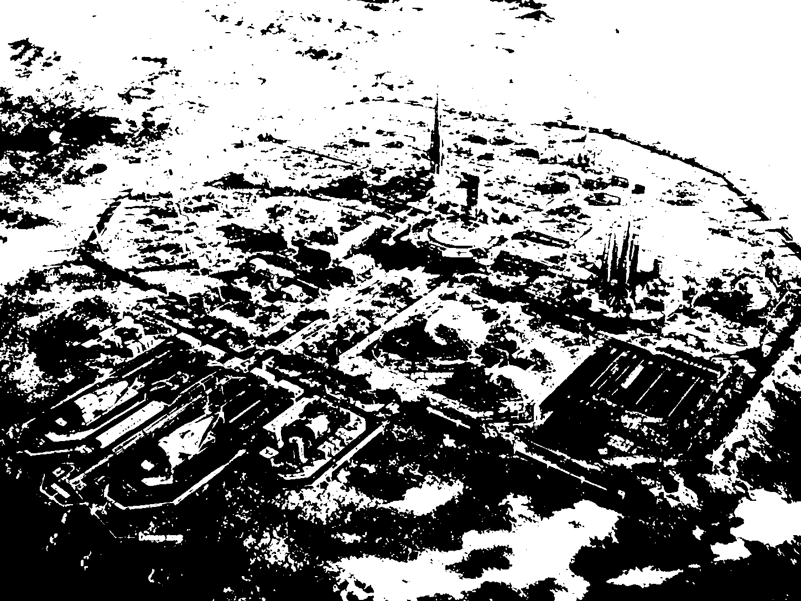

# SIRZ

PLANET MARS

Developing high-risk, high-value research laboratory and research programmes focused on energy.

The proposal is connected to the Strategic Independent Research Zone (SIRZ), the Foundation for Strategic Independent Research & Civic Ethics (FSIRCE), and Live Core: Field-Confined High-Energy Storage and Phase-Steered Coupling System, which is available on SSRN.

* Proposal: Establish a neutral, offshore, high-security research enclave dedicated to high-risk, high-reward research in artificial intelligence, bio-synthetic systems, human augmentation, neural interfaces and advanced cognition.

* Governance: An internationally composed Ethics and Security Committee would provide continuous oversight to maintain transparency and ethical rigour. SIRZ would operate as part of the broader Foundation for Strategic Independent Research & Civic Ethics (FSIRCE), which would coordinate implementation, supervision and dialogue between relevant sectors.

(C) 2025 - 2026 Pezhman Farhangi 
